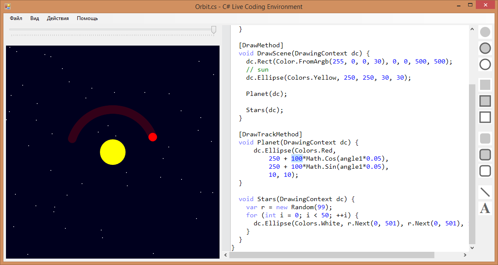
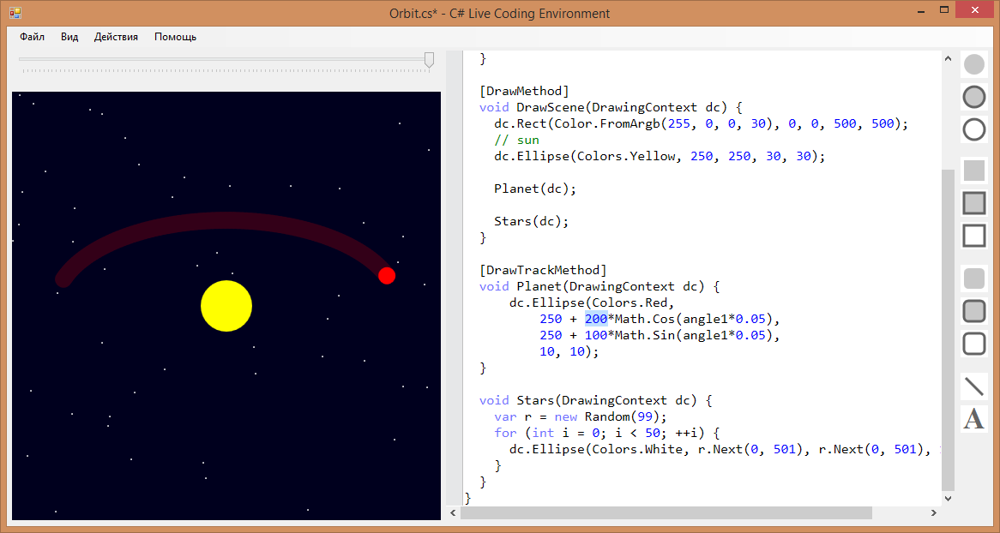

# C# Live Coding Environment

C# Live Coding Environment is a C# code editor that compiles and runs your code on-the-fly (at the moment you type it). It brings fun to the process of programming as well as makes it more interactive.

The idea of the project is based on Bret Victor's talk 'Inventing on Principle' given at CUSEC, 2012.

 

TODOs
----
 - Remove Init() method, remove wait for infinite loops

License
----
GPL3
